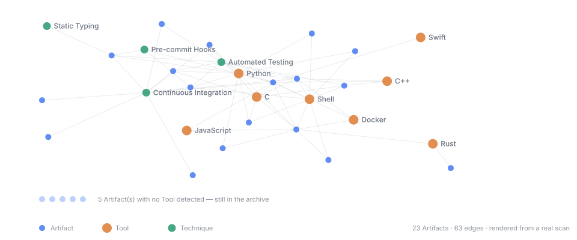

# dendrograph

**A knowledge graph of what you have built.** Point it at your git repositories and get a
navigable map of Artifacts, Tools, Techniques and time — one that can answer *how long
have I actually used Rust?* with a date instead of a guess.



<sup>A real scan of a public GitHub organisation — 23 repositories, no credential, no
configuration. Regenerate with `python3 tools/render_svg.py <archive>/site/graph.json
docs/example-graph.svg`.</sup>

No server. No database. No account. Python 3.11+ and nothing else — the published site is
a folder you can open from a pen drive with the network unplugged.

```bash
cd dendrograph
python3 cli.py scan github:tinygrad --root ~/my-archive   # any public account
python3 cli.py build --root ~/my-archive
xdg-open ~/my-archive/site/index.html                     # or just open the file
```

No credential needed for a public account. The first scan clones full history into a
temporary directory and throws it away — nothing is cached between runs.

Or skip the scan and open a real one: [`examples/site/index.html`](examples/site/) is a
published archive of 57 public repositories, committed to this repository. No install, no
account, and it renders with the network unplugged. `examples/README.md` says what the
privacy default kept out of it.

---

## The machine proposes, the Author disposes

This is the rule the rest of the design follows from, and it is worth stating before the
feature list.

dendrograph is **confident about what it observed and deferential about what it
interpreted.** It will tell you a repository's first commit was in March 2019, because it
read that. It will *not* tell you that one project succeeded another — it will notice the
resemblance, print the config line that would say so, and wait. If you never paste the
line, the relationship never exists, and nothing in the archive is blocked waiting for
you.

The same rule, in the places you will meet it:

- `dendro suggest` proposes successions, Collections and identity merges. **It creates
  nothing.**
- `dendro prune` lists what looks like clutter and prints the lines that would hide it.
  **It deletes nothing.** Excluding an Artifact omits it from the graph and leaves it in
  the store; delete the line and it comes back intact. A tool built because memory is
  unreliable must not offer one-command amnesia.
- Identity is overridable. If the tool decides two repositories are one Artifact and you
  disagree, say so in config and you win.
- Epoch Markers — the dated lines across your timeline, like *AI assistants arrive* — are
  declared by you and never inferred.

## Two things it refuses to do

Not "not yet". Refused:

1. **It does not judge your work.** No quality score, no grade, no complexity measure, no
   guess about whether a person or a model wrote something. It records what was built and
   when. A test sweeps every generated file for that vocabulary and fails the build if it
   appears.
2. **It does not overstate.** Where a number could be read two ways, it takes the smaller
   one. A fork you never committed to contributes no dates to your Tool spans, even though
   it sits in your archive — otherwise forking a 2009 project would have you claiming
   seventeen years of C++.

## What the published site contains, and what it does not

The default is `public` mode, and under it the site contains **no private Artifact**: no
name, no description, no URL, no source locator, no Technique evidence path, no content
hash.

That is not a filter you switch on. Private Artifacts are excluded until you opt each one
in by name, one at a time.

| | `public` (default) | `redacted` | `full` |
|---|---|---|---|
| Public Artifacts | yes | yes | yes |
| Private Artifacts | no | no, but counted | yes |
| Aliased Artifacts | node + dates, plus what `reveal` names | same | real name |
| Writes to | `site/` | `site/` | `.dendro-local/` |

`full` writes to a different directory on purpose. It is not a flag that a publish step
has to remember to check — a full build has no path to `site/` at all.

### Publishing private work without naming it

Client work you cannot name is still work you did. An **alias** publishes the node and its
dates under a label you choose (or a generated *Private project 3*), and reveals nothing
further until you name each field:

```toml
[[publish.alias]]
id = "root-a1b2c3..."
label = "Anonymous fintech project"
reveal = ["period", "tools"]        # authorship stays hidden
```

Disclosure is opt-in per field. There is no opt-out redaction, because the failure mode of
opt-out is a field you forgot about. Some things never cross at any setting: the real name,
the description, the URL, source locators, Technique evidence paths, content hashes and
lineage edges.

**This does not make you unidentifiable.** Someone who knows your work may still recognise
a project from its dates and Tools. An alias is for the reader who does not already know —
it is not anonymity against a determined guess. See `docs/adr/0011`.

## Your archive is a separate repository

The tool holds no data of yours. Your Artifacts, your config and your decisions live in an
archive repository that is yours, which can be private while the site it publishes is
public (ADR-0010).

1. **Create a repository from `templates/archive/`.** It works untouched — an absent
   config is valid, and `dendro scan <path>` needs none of it.
2. **Edit `dendrograph.toml`.** Every example in it is commented out and every one of them
   is valid if you uncomment it. Set `[archive].emails` to the addresses you commit under:
   without them there is no "yours" to measure, and Tool spans say so rather than passing
   a fork's dates off as your experience.
3. **Scan.** `dendro scan` locally, or let the included Actions workflow refresh
   GitHub-sourced Artifacts on a schedule. Interactive auth is `dendro login`, an OAuth
   device flow — no personal access token to mint or store. CI uses a PAT because there is
   no browser there, and that is the only place one is supported (ADR-0008).
4. **Build.** `dendro build` rebuilds `site/` from the store. It is a derived directory;
   deleting it costs nothing, and deleting the store costs everything.
5. **Publish.** `dendro publish` pushes `site/` to `[publish].target_repository`, or serve
   `site/` with GitHub Pages, or just open it from disk.

## What ends up in the archive

`store/artifacts/<id>.json`, one file per Artifact, committed and readable in a diff. That
is the source of truth; `graph.json`, `graph.sqlite`, `llms.txt` and the two views are all
derived from it and regenerated on every build.

**Scans append.** They never rebuild. A drive that dies, an account that closes, a
repository that is deleted — the Artifact stays, and the source is marked unreachable with
the date it was last seen. That is the whole point: the archive outlives the things it was
built from.

An Artifact's identity is the SHA of its root commit, so it survives being cloned, renamed,
re-hosted and moved between disks. A fork shares that SHA and **is** the same Artifact —
which is where free fork detection comes from, and why *how much of it is yours* is a
separate question with a separate answer.

## For programs and agents

Every build writes `llms.txt` — the archive in prose, including what it deliberately does
not contain — alongside `graph.json`, which is self-describing: its `schema` key lists
every node and edge type, so nothing needs this README to read it. `graph.sqlite` holds
the same data as tables.

## Running it

```bash
python3 -m unittest discover -s tests
```

No dependencies to install, and none at runtime either.

## Contributing

See [CONTRIBUTING.md](CONTRIBUTING.md). The short version: `.specify/memory/constitution.md`
is binding and `docs/adr/` records why each decision was made — work that contradicts
either can still be right, but it has to say so out loud.

## License

MIT. See [LICENSE](LICENSE) and `docs/adr/0006`, which explains why it is not AGPL and asks
that the question not be reopened without new information.
